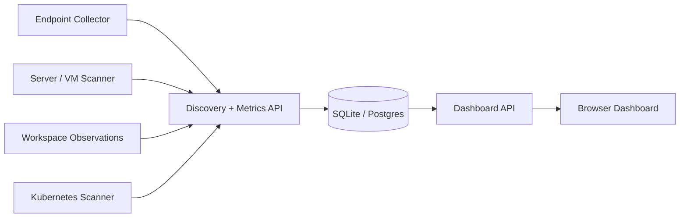

# Codex Agent Monitor

A polished MVP for discovering, monitoring, and reviewing `Codex-only` agents across endpoints, servers, and cloud environments.

It combines three layers in one lightweight project:

- `discovery confidence`: confirmed, observed, and suspected Codex agents
- `operational telemetry`: CPU, memory, disk, network, process usage, and cost
- `heartbeat monitoring`: healthy, delayed, and stale agents at fleet and per-agent level

## Dashboard gallery

### Full overview


### Fleet pulse and discovery trust


### Resource and heartbeat monitoring


### Agent telemetry cards


### Host pressure and recent jobs


## What it does

Codex Agent Monitor is designed around a realistic constraint: you usually cannot perfectly scan any machine and prove every process is a Codex agent. So the monitor models trust explicitly instead of pretending discovery is perfect.

### Discovery model

- `confirmed`: strong local evidence such as known Codex CLI/app signatures or managed launcher evidence
- `observed`: workspace-side evidence without local proof on the host
- `suspected`: heuristic detection that still needs review

### Monitoring coverage

- fleet summary and discovery mix
- host CPU, memory, disk, and network telemetry
- per-agent process CPU, memory, disk I/O, uptime, and restart count
- heartbeat freshness with `healthy`, `delayed`, and `stale` states
- hot-host ranking for machines under the highest current pressure
- recent job timeline with model, duration, and outcome
- raw sample DB export through JSON endpoints

## Architecture



## Tech stack

- `Node.js 24` with built-in `node:sqlite`
- plain HTML, CSS, and JavaScript dashboard
- SQLite sample DB for seeded demo data
- Node test runner for API and data verification

## Project structure

```text
assets/screenshots/   Dashboard screenshots for the repo
public/               Dashboard frontend
scripts/              Seed and preview generation scripts
src/                  SQLite schema, aggregations, and HTTP server
tests/                End-to-end API and seed tests
data/                 Local runtime artifacts and generated previews
```

## Quick start

```powershell
cd C:\Users\ManishKL\Downloads\Codex-Agent-Monitor
npm run seed
npm start
```

Open [http://localhost:3000](http://localhost:3000).

## Run tests

```powershell
npm test
```

## API endpoints

- `/api/health`
- `/api/dashboard`
- `/api/sample-db`

## Seeded demo data

The sample seed currently includes:

- `3` hosts
- `4` agent instances
- `4` discovery events
- `4` heartbeat snapshots
- `4` jobs
- `3` workspace observations
- `3` host metric snapshots
- `4` agent metric snapshots

## Example telemetry in this MVP

- peak host CPU: `67.4%`
- average host CPU: `56.1%`
- average memory usage: `66.5%`
- peak disk usage: `72.3%`
- total network throughput: `6260 kbps`
- heartbeat state mix: `0 healthy`, `2 delayed`, `2 stale`

## Suggested next steps

- collector ingest API for real endpoint scanners
- alert rules for stale agents and high resource pressure
- sparkline history for heartbeat and resource trends
- host and agent drill-down pages
- geo and topology views
- RBAC and multi-tenant workspace support
