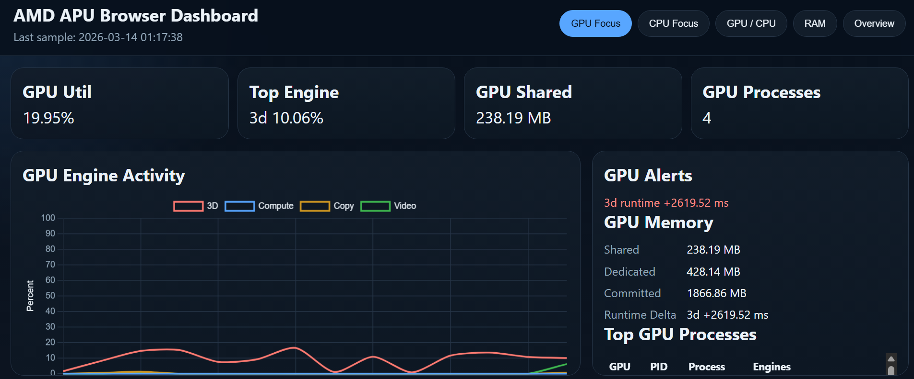
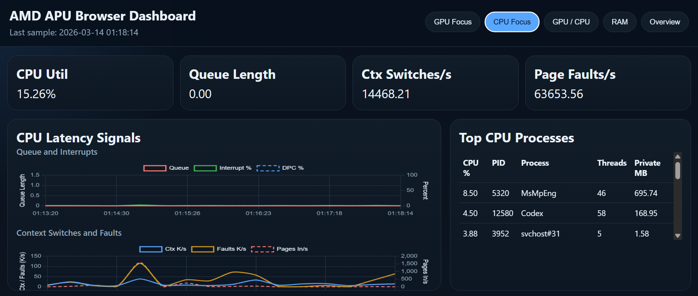
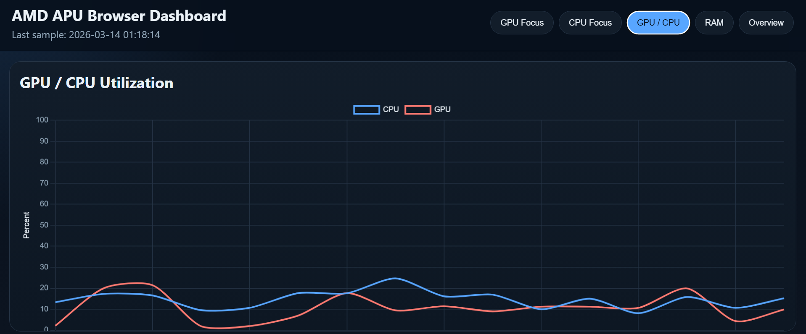
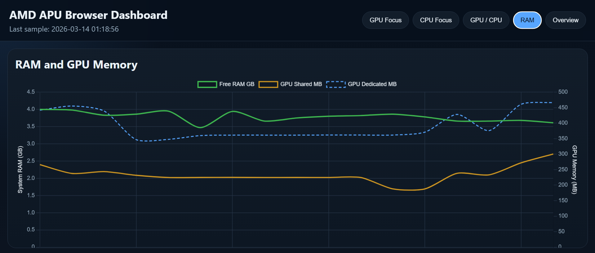
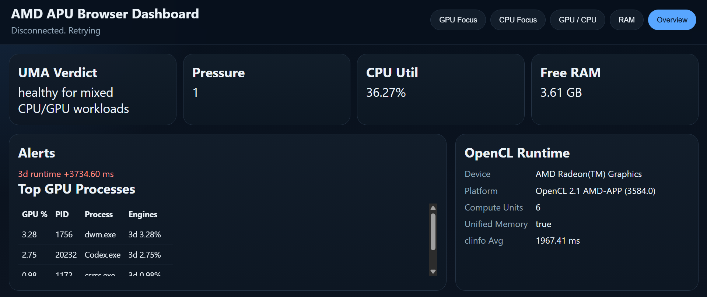
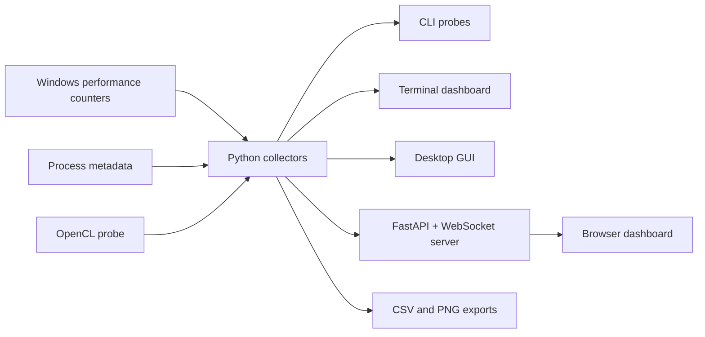

# AMD APU Toolkit

[](https://github.com/manishklach/amd-apu-toolkit/releases/tag/v1.0.2)
[](https://github.com/manishklach/amd-apu-toolkit/blob/main/LICENSE)
[](https://github.com/manishklach/amd-apu-toolkit/releases/download/v1.0.2/amd-apu-monitor-windows-x64-v1.0.2.zip)

Windows-first telemetry, tracing, and dashboards for AMD APU laptops and desktops.

This project targets the practical gap between Task Manager and heavyweight vendor tooling. It collects live CPU, GPU, memory, and OpenCL signals from a Windows AMD APU system and exposes them through:

- a terminal dashboard
- a native desktop GUI
- a browser dashboard
- CLI probes and CSV exporters

## Download

- [Download Windows package for v1.0.2](https://github.com/manishklach/amd-apu-toolkit/releases/download/v1.0.2/amd-apu-monitor-windows-x64-v1.0.2.zip)
- [Open the latest release notes](https://github.com/manishklach/amd-apu-toolkit/releases/tag/v1.0.2)

## Screenshots

### GPU Focus



### CPU Focus



### GPU / CPU



### RAM



### Overview



## What V1 includes

- `inspect-uma`: rates shared CPU/GPU memory pressure on an AMD APU
- `correlate-power`: samples CPU, GPU, and memory counters into CSV traces
- `probe-opencl`: inspects the local OpenCL runtime and captures a quick baseline
- `dashboard`: live terminal dashboard with optional CSV recording
- `snapshot-dashboard`: exports a terminal dashboard PNG
- `gui`: desktop dashboard with live charts and export support
- `trace-gpu`: top GPU-consuming processes, sorted by descending utilization
- `serve-web`: local realtime browser dashboard with GPU Focus, CPU Focus, RAM, GPU/CPU, Sensors, and Overview views
- `capture-trace`: WPR-based ETW trace capture for CPU/GPU/Video analysis
- `trace-preflight`: checks whether trace capture is actually runnable on the current Windows session

## Why this exists

Integrated AMD systems behave differently from discrete GPU workstations:

- CPU and GPU share memory bandwidth
- desktop compositing and browser GPU processes can distort "real" load
- stutter often comes from scheduling or memory pressure, not raw utilization
- Windows exposes useful counters, but not in one coherent view

This toolkit consolidates those signals into one place and keeps the collection path simple enough to run on a normal Windows machine.

## Architecture



## Install

## Releases and distribution

Latest release:

- [v1.0.2 release](https://github.com/manishklach/amd-apu-toolkit/releases/tag/v1.0.2)

Current state:

- the release includes screenshots, release notes, and a downloadable Windows GUI package
- the packaged binary is published as `amd-apu-monitor-windows-x64-v1.0.2.zip`
- the repo still supports building the Windows EXE locally

If you want to run it today, download the Windows package from Releases, install from source, or build the EXE locally:

Requirements:

- Windows 10 or Windows 11
- Python 3.11+
- PowerShell
- `clinfo` optional, but recommended for `probe-opencl`

```powershell
git clone https://github.com/manishklach/amd-apu-toolkit.git
cd amd-apu-toolkit
python -m pip install -e .
```

## Quick start

```powershell
amd-apu-toolkit inspect-uma
amd-apu-toolkit correlate-power --duration 10 --interval 1
amd-apu-toolkit probe-opencl --iterations 5
amd-apu-toolkit dashboard --refresh 2
amd-apu-toolkit dashboard --refresh 2 --record-path output/live_trace.csv
amd-apu-toolkit snapshot-dashboard --output output/dashboard_snapshot.png
amd-apu-toolkit gui --refresh 2
amd-apu-toolkit trace-gpu --limit 12
amd-apu-toolkit trace-gpu --watch --interval 1 --limit 12
amd-apu-toolkit trace-preflight
amd-apu-toolkit capture-trace --duration 15 --profiles CPU GPU Video
amd-apu-toolkit serve-web --host 127.0.0.1 --port 8765 --refresh 2
```

Open the browser dashboard at [http://127.0.0.1:8765](http://127.0.0.1:8765).

## Browser dashboard

The browser dashboard is the main V1 experience. It includes:

- `GPU Focus`: engine activity, GPU process ranking, shared and dedicated memory, runtime deltas
- `CPU Focus`: queue length, context switches, page faults, interrupt and DPC activity, top CPU processes
- `GPU / CPU`: fixed-scale utilization trend view
- `RAM`: system RAM and GPU memory with separate axes
- `Sensors`: CPU frequency, perf-limit metrics, optional GPU clocks, temperature, and power
- `Overview`: UMA verdict, alerts, risk drivers, OpenCL runtime information, top GPU activity, and ETW trace capture controls

The browser UI uses Chart.js and a local FastAPI + WebSocket backend. No cloud service is involved.

## Optional sensor setup

The dashboard now supports an optional sensor bridge for clocks, temperature, and power.

What works without extra tools:

- CPU effective frequency style metrics
- CPU performance limit counters
- power plan and battery state

What needs an optional local provider:

- GPU core clock
- GPU memory clock
- GPU temperature
- GPU power

Supported providers:

- `LibreHardwareMonitor`
- `OpenHardwareMonitor`

How to enable it:

1. install and run `LibreHardwareMonitor` or `OpenHardwareMonitor`
2. enable the WMI interface in that tool
3. keep the tool running locally
4. restart `amd-apu-toolkit serve-web`

When the provider is active, the `Overview` page will switch the `Sensor Snapshot` provider from `windows-only` to the detected provider name and start filling GPU sensor fields.

If no provider is installed, the dashboard still works. GPU sensor fields will remain `n/a`.

## ETW trace capture

The toolkit now includes a Windows Performance Recorder capture path for short CPU/GPU/Video traces.

What it adds:

- browser controls on `Overview`
- CLI capture for unattended runs
- preflight checks so the app can tell you whether tracing is actually allowed
- trace metadata written next to the `.etl`
- optional `tracerpt` summary generation after a successful stop

### CLI examples

Check whether the current session can capture traces:

```powershell
amd-apu-toolkit trace-preflight
```

Capture a 15 second CPU/GPU/Video trace:

```powershell
amd-apu-toolkit capture-trace --duration 15 --profiles CPU GPU Video
```

Capture a longer trace with extra disk and power context:

```powershell
amd-apu-toolkit capture-trace --duration 30 --profiles CPU GPU Video DiskIO Power
```

### Browser workflow

1. Start the browser dashboard:

```powershell
amd-apu-toolkit serve-web --host 127.0.0.1 --port 8765 --refresh 2
```

2. Open [http://127.0.0.1:8765](http://127.0.0.1:8765)
3. Go to `Overview`
4. Check `Preflight`
5. If it says `ready`, click `Start 15s Trace`
6. After completion, inspect:
   - `Last Trace`
   - `Summary`
   - the metadata `.json`

Trace outputs are written under:

- `output/traces`

Typical files:

- `wpr_trace_YYYYMMDD_HHMMSS.etl`
- `wpr_trace_YYYYMMDD_HHMMSS.json`
- `wpr_trace_YYYYMMDD_HHMMSS_summary.txt`

### Important requirement

On many Windows machines, WPR capture needs an elevated shell.

If trace preflight reports `not ready` or capture fails with `0xc5585011`, run the toolkit from an elevated PowerShell:

1. open `Windows PowerShell` as Administrator
2. `cd` into the repo
3. start the dashboard or CLI again

Example:

```powershell
cd C:\Users\ManishKL\Documents\Playground\amd-apu-toolkit
python -m amd_apu_toolkit.cli serve-web --host 127.0.0.1 --port 8765 --refresh 2
```

Then verify:

```powershell
python -m amd_apu_toolkit.cli trace-preflight
```

You want:

- `preflight.ready: True`

### What trace capture is for

Use ETW capture when the live dashboard tells you there is a real issue, but you need deeper timing evidence:

- frame pacing investigation
- CPU hotspot escalation
- GPU/video glitch investigation
- compositor or browser pipeline analysis
- short reproductions of stutter or latency spikes

## Demo scenarios

The toolkit is easiest to understand when run against repeatable scenarios instead of idle desktop usage. Good canned demos:

- browser or video playback: watch compositor activity, GPU process ranking, and shared memory movement
- game or emulator load: compare `GPU Focus` and `GPU / CPU` to see whether stutter aligns more with CPU or GPU pressure
- local LLM or OpenCL stress: use `probe-opencl`, `trace-gpu`, and the browser dashboard to see compute vs copy behavior
- memory-pressure or stutter scenario: open heavy apps or browser tabs and watch `UMA`, free RAM, queue length, and page faults together

For a short product demo, the strongest sequence is:

1. start `serve-web`
2. show `GPU Focus` during video playback or a game menu
3. switch to `CPU Focus` under system load
4. switch to `RAM` to show shared-memory effects
5. finish on `Overview` for the verdict and OpenCL runtime summary

## Why choose this over X?

| Tool | Good at | Weak at | Where AMD APU Toolkit fits |
| --- | --- | --- | --- |
| Task Manager | quick process and utilization checks | weak correlation across UMA, GPU engines, CPU latency, and OpenCL | use this when you need one coherent APU-centric view |
| HWiNFO | broad hardware sensor coverage | less focused on process attribution and browser-ready dashboards | complementary if you care about sensors and this project handles workload correlation |
| Vendor overlays | lightweight in-game summaries | usually narrow, transient, and not great for root-cause analysis | use this when you want history, process ranking, and memory-pressure context |
| ETW / WPA / xperf-class tools | deep trace analysis and hotspots | high setup cost, heavy workflow, less approachable for live monitoring | use this for fast interactive triage before deciding whether full tracing is necessary |

This toolkit is not a replacement for ETW-grade analysis. It is the faster first-pass tool for answering:

- is the bottleneck CPU, GPU, memory pressure, or scheduling noise?
- which processes are actually touching the GPU?
- is the APU under shared-memory stress?
- should I escalate to heavier tracing tools?

## Feature matrix

| Capability | CLI | Terminal dashboard | Desktop GUI | Browser dashboard |
| --- | --- | --- | --- | --- |
| UMA pressure verdict | Yes | Yes | Yes | Yes |
| CPU utilization | Yes | Yes | Yes | Yes |
| GPU utilization | Yes | Yes | Yes | Yes |
| GPU process ranking | Yes | No | Yes | Yes |
| CPU process ranking | No | No | No | Yes |
| OpenCL runtime details | Yes | Yes | Yes | Yes |
| Sensor provider status | No | No | No | Yes |
| ETW trace preflight | Yes | No | No | Yes |
| ETW trace start/stop | Yes | No | No | Yes |
| CSV export | Yes | Yes | Yes | No |
| PNG export | Yes | Yes | Yes | No |
| Realtime browser view | No | No | No | Yes |

## Desktop GUI

The native desktop GUI includes:

- compact and high-DPI-aware layout
- full-screen chart views
- GPU Focus, RAM, GPU/CPU, and Overview views
- live top GPU processes
- alert thresholds saved to `output/gui_settings.json`
- chart export to `output/gui_chart_snapshot.png`
- optional CSV recording from the app

## CLI tools

### `inspect-uma`

Scores current APU memory pressure and returns a quick verdict for mixed CPU/GPU workloads.

```powershell
amd-apu-toolkit inspect-uma
```

### `correlate-power`

Samples CPU, GPU, and memory counters over time and writes a CSV trace.

```powershell
amd-apu-toolkit correlate-power --duration 30 --interval 1
```

### `probe-opencl`

Reports OpenCL device details and times repeated `clinfo` invocations as a rough baseline.

```powershell
amd-apu-toolkit probe-opencl --iterations 5
```

### `trace-gpu`

Ranks GPU-consuming processes by total utilization and supports watch mode.

```powershell
amd-apu-toolkit trace-gpu --limit 10
amd-apu-toolkit trace-gpu --watch --interval 1 --limit 10
```

### `trace-preflight`

Reports whether the current Windows session is ready for WPR capture.

```powershell
amd-apu-toolkit trace-preflight
```

Example output on a non-elevated shell:

```text
preflight: {'ready': False, 'is_admin': False, 'wpr_available': True, 'tracerpt_available': True, 'reason': 'WPR capture likely requires an elevated shell on this machine'}
```

### `capture-trace`

Captures a short ETW trace using WPR profiles such as `CPU`, `GPU`, `Video`, `DiskIO`, and `Power`.

```powershell
amd-apu-toolkit capture-trace --duration 15 --profiles CPU GPU Video
```

On success, the toolkit writes the trace and metadata under `output/traces`.

## Build a Windows EXE

```powershell
powershell -ExecutionPolicy Bypass -File .\scripts\build_windows_exe.ps1
```

The generated executable is written under `dist\amd-apu-monitor`.

## Known-good test hardware

This V1 build was exercised on the following local machine:

- CPU: `AMD Ryzen 3 5300U with Radeon Graphics`
- Cores / threads: `4 / 8`
- GPU: `AMD Radeon(TM) Graphics`
- GPU driver: `31.0.21914.8004`
- RAM: about `15.3 GB visible to Windows`
- OS: `Microsoft Windows 11 Home Single Language`
- Build: `26200`

This matters because Windows GPU counters vary by hardware generation and driver branch. If your system exposes a different counter set, the toolkit will collect a narrower metric set.

## Data sources

This toolkit primarily uses:

- Windows performance counters
- PowerShell counter enumeration and sampling
- process metadata from Windows
- local OpenCL runtime information

It does not require ROCm.

## Current limitations

- GPU process attribution is process-level, not instruction-level or true per-thread GPU time
- some Windows counter sets vary across driver versions and hardware generations
- AMD clocks, power draw, thermals, and fan speeds are not exposed yet through a vendor-specific API
- browser charts depend on a locally running Python backend
- ETW capture depends on Windows policy and usually requires an elevated shell
- real frame-time analysis is not parsed yet from ETL; current capture is the acquisition layer

## Troubleshooting

### Trace capture says `not ready`

Run:

```powershell
amd-apu-toolkit trace-preflight
```

If `is_admin` is `False`, reopen PowerShell as Administrator and try again.

### Trace capture fails with `0xc5585011`

That means WPR start was blocked by current tracing policy or privileges. The fastest fix is to run the dashboard or CLI from an elevated shell.

### GPU clocks and temperature are `n/a`

That is expected until `LibreHardwareMonitor` or `OpenHardwareMonitor` is running locally with WMI enabled.

## Roadmap

- ETW capture integration for CPU hotspot traces
- AMD-specific clocks and thermal telemetry if a stable API path is added
- richer export flows and time-range analysis
- optional packaged browser dashboard build for offline distribution

## License

MIT. See [LICENSE](LICENSE).
