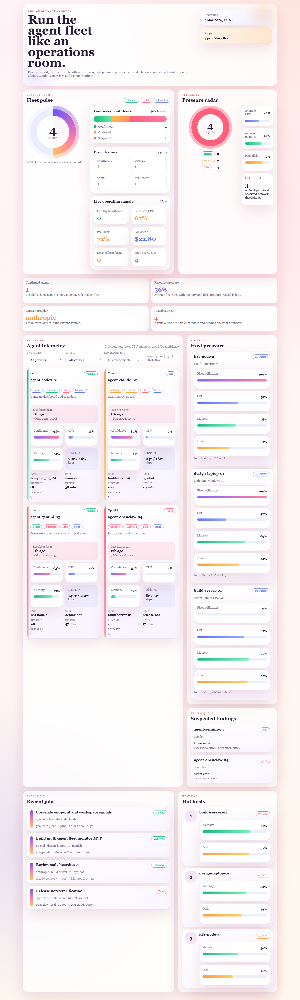
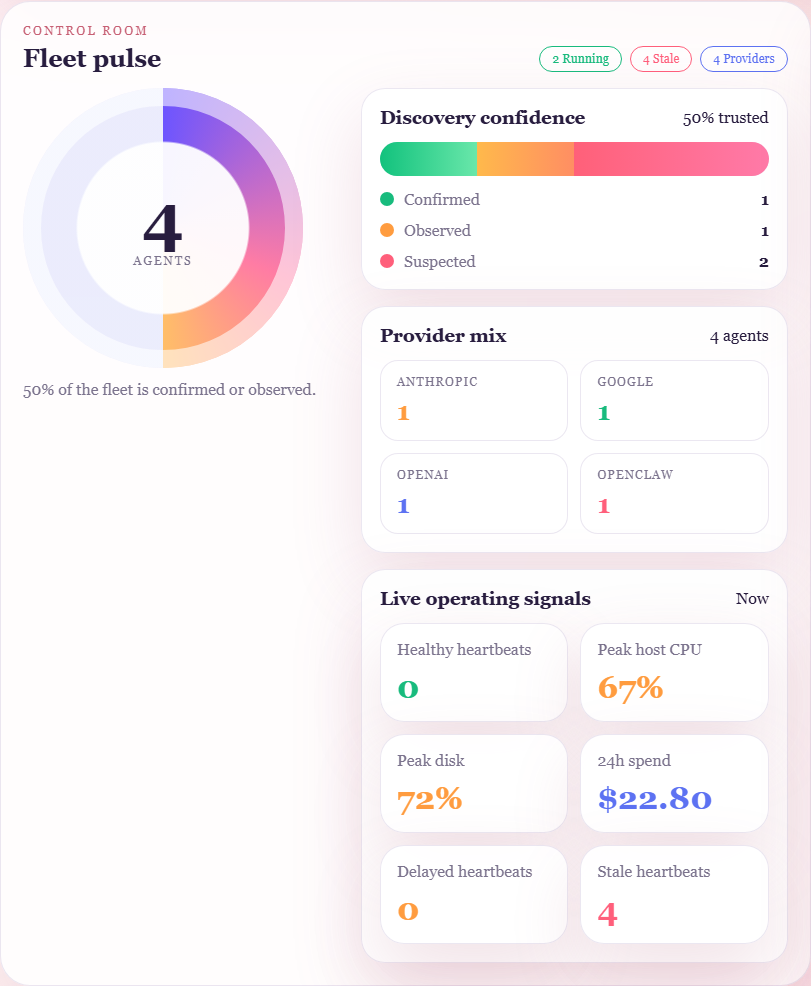
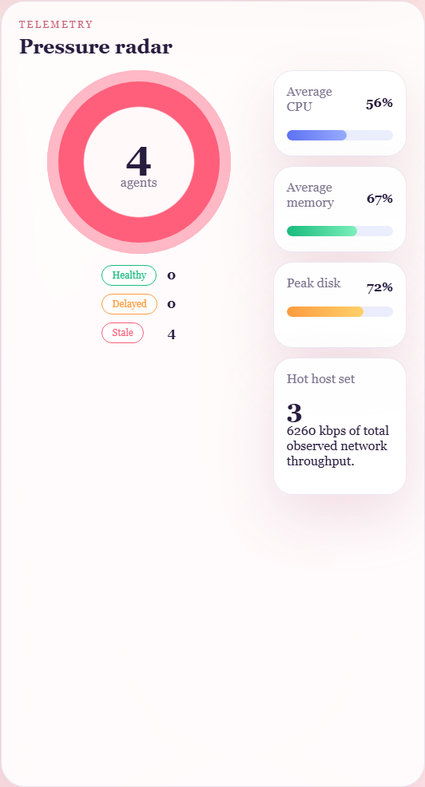
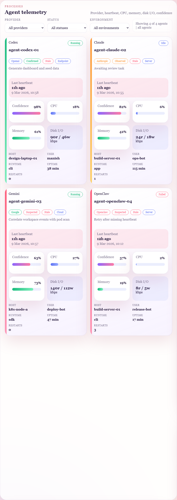
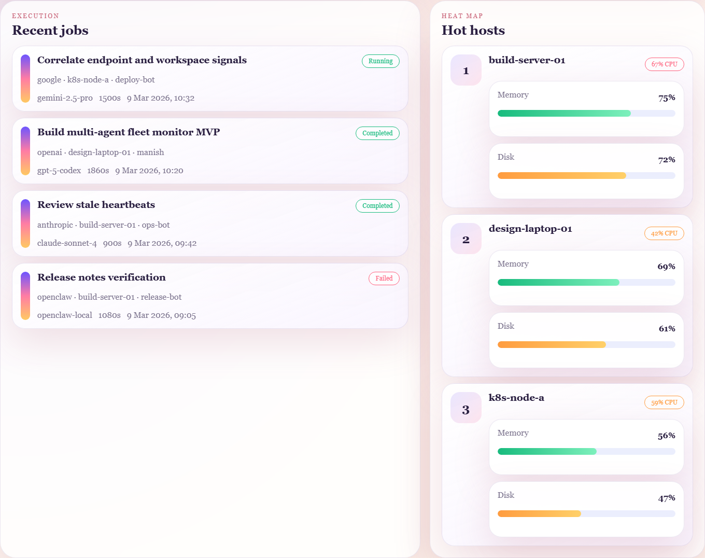
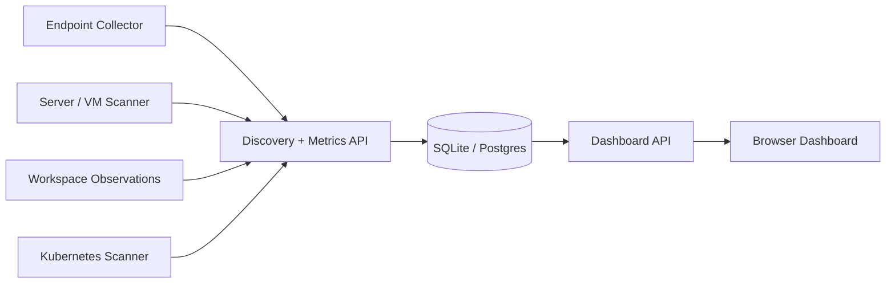

# Universal Agent Monitor

A polished MVP for discovering, monitoring, and reviewing multi-provider agents across endpoints, servers, and cloud environments.

It now models agents generically instead of being locked to one vendor.

## Supported sample providers in this repo

- `OpenAI / Codex`
- `Anthropic / Claude`
- `Google / Gemini`
- `OpenClaw`

## Dashboard gallery

### Full overview



### Fleet pulse and provider mix



### Resources and heartbeat monitoring



### Agent telemetry cards



### Hosts and recent jobs



## What it does

The monitor separates two concerns that are often mixed together:

- `provider intelligence`: Codex, Claude, Gemini, OpenClaw, or custom
- `runtime operations`: discovery, heartbeat, CPU, memory, disk, network, jobs, and cost

That makes it possible to monitor heterogeneous agent fleets through one normalized dashboard and schema.

## Monitoring coverage

- confirmed, observed, and suspected discovery states
- provider-neutral fleet inventory
- normalized runtime metadata with `provider`, `agent_family`, and `runtime_type`
- host CPU, memory, disk, and network telemetry
- per-agent process CPU, memory, disk I/O, uptime, and restart count
- heartbeat freshness with `healthy`, `delayed`, and `stale` states
- hot-host ranking for machines under the highest pressure
- recent job timeline with model, duration, provider, and outcome
- dashboard filters for provider, status, and environment
- raw sample DB export through JSON endpoints

## Architecture



## Tech stack

- `Node.js 24` with built-in `node:sqlite`
- plain HTML, CSS, and JavaScript dashboard
- SQLite sample DB for seeded demo data
- Node test runner for API and data verification

## Project structure

```text
assets/screenshots/   Dashboard screenshots for the repo
public/               Dashboard frontend
scripts/              Seed and preview generation scripts
src/                  SQLite schema, aggregations, and HTTP server
tests/                API and seed verification
data/                 Local runtime artifacts and generated previews
```

## Quick start

```powershell
cd C:\Users\ManishKL\Downloads\Codex-Agent-Monitor
npm run seed
npm start
```

Open [http://localhost:3000](http://localhost:3000).

## Run tests

```powershell
npm test
```

## API endpoints

- `/api/health`
- `/api/dashboard`
- `/api/sample-db`

## Normalized agent schema

Each monitored runtime is modeled as a provider-neutral agent instance with fields such as:

- `provider`
- `agent_family`
- `runtime_type`
- `host_id`
- `status`
- `discovery_level`
- `confidence_score`
- `cpu`, `memory`, `disk`, `network`
- `tokens_used`, `cost_usd`
- `job metadata`

## Seeded demo data

The sample seed currently includes:

- `3` hosts
- `4` multi-provider agent instances
- `4` discovery events
- `4` heartbeat snapshots
- `4` jobs
- `3` workspace observations
- `3` host metric snapshots
- `4` agent metric snapshots

## Example telemetry in this MVP

- peak host CPU: `67.4%`
- average host CPU: `56.1%`
- average memory usage: `66.5%`
- peak disk usage: `72.3%`
- total network throughput: `6260 kbps`
- heartbeat state mix: `0 healthy`, `0 delayed`, `4 stale`
- provider mix: `openai`, `anthropic`, `google`, `openclaw`

## Suggested next steps

- real collector ingest API for endpoint and server scanners
- alert rules for stale agents and high resource pressure
- sparkline history for heartbeat and resource trends
- host and agent drill-down pages
- geo and topology views
- RBAC and multi-tenant workspace support
